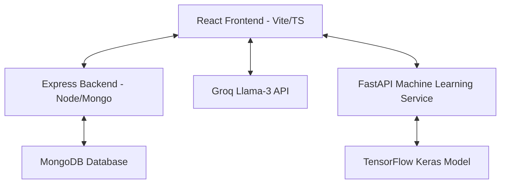

# SmartAgro 🌾

SmartAgro is a state-of-the-art, AI-powered agricultural intelligence and advisory platform. It integrates modern technologies like computer vision, large language models (LLMs), Internet of Things (IoT), and real-time data analysis to help farmers optimize yields, monitor crop health, track weather impacts, and manage farm profitability.

---

## 🏗️ Architecture & Tech Stack



### 1. Frontend (`/frontend`)
* **Framework:** React 18, Vite, TypeScript
* **Styling:** Tailwind CSS (v3), Framer Motion (for smooth glassmorphism animations)
* **Icons & Charts:** Lucide React, Recharts (for weather and statistics visualization)
* **Features:** Auth integration, AI Advisor chat panel, real-time weather analytics, mandi market prices, and Gov Schemes browser.

### 2. Backend Server (`/server`)
* **Runtime:** Node.js (Express)
* **Database:** MongoDB (Mongoose ODM)
* **Authentication:** Cookie-based JWT sessions
* **APIs:** Crop/field profiles, historical chat log caching, farm statistics, and IVR dialer configuration.

### 3. Machine Learning Backend (`/backend`)
* **Framework:** Python, FastAPI, Uvicorn
* **Deep Learning:** TensorFlow, Keras (EfficientNetB0)
* **Model:** Plant disease classification model running on image specimens.

---

## 🌟 Core Features

* **🌾 Crop & Fertilizer Prediction:** Input soil NPK values and pH to receive optimized crop suitability suggestions and custom AI-generated fertilizer advice (integrated with Groq API).
* **📸 AI Crop Disease Scanner:** Upload plant leaf images to classify and identify diseases (Late Blight, Yellow Leaf Curl, etc.) instantly with a confidence rating and treatment protocols.
* **⛅ Weather Intelligence:** Hyper-local weather forecasting with direct suggestions on how climate changes impact specific crops (irrigation, disease risks).
* **📈 Mandi Prices:** Live market trends tracking agricultural commodity rates and price fluctuations.
* **🏛️ Government Schemes:** Comprehensive list of active agricultural subsidies and direct links to apply.
* **🤖 Voice Assistant:** Hands-free voice assistant widget supporting voice-guided platform navigation.

---

## 🚀 Quick Start Guide

### Prerequisites
* [Node.js](https://nodejs.org/) (v18+)
* [Python](https://www.python.org/) (v3.9+)
* [MongoDB](https://www.mongodb.com/) (for development: local instance OR MongoDB Atlas for production)

---

### 🛠️ Development Setup (Local)

#### 1. Setup the Server Backend
```bash
cd server
npm install
```
Create a `.env` file in the `server` directory:
```env
PORT=5000
MONGO_URI=mongodb://localhost:27017/smartagro
JWT_SECRET=your_dev_jwt_secret_min_32_chars
GROQ_API_KEY=your_groq_api_key
DISEASE_API_URL=http://localhost:5001
NODE_ENV=development
```
Start the backend server:
```bash
npm run dev
```

#### 2. Setup the Machine Learning Backend
```bash
cd backend
python -m venv venv
source venv/bin/activate  # On Windows: venv\Scripts\activate
pip install -r requirements.txt
```
Ensure your disease classification model weights file (`disease_model.h5` or `disease_model.weights.h5`) is placed inside the `model/` folder in the root workspace.

Start the FastAPI ML server:
```bash
python app.py
```

#### 3. Setup the Frontend
```bash
cd frontend
npm install
```
Create a `.env` file in the `frontend` directory:
```env
VITE_API_URL=http://localhost:5000
VITE_DISEASE_API_URL=http://localhost:5001
VITE_GROQ_API_KEY=your_groq_api_key
VITE_WEATHER_API_KEY=your_openweather_api_key
```
Start the frontend development server:
```bash
npm run dev
```

---

### 🌐 Production Deployment (Vercel + Render + MongoDB Atlas)

#### Prerequisites for Production
- GitHub account (for connecting to Vercel/Render)
- [Vercel account](https://vercel.com) (free tier)
- [Render account](https://render.com) (free tier)
- [MongoDB Atlas account](https://www.mongodb.com/cloud/atlas) (free tier - 512MB storage)
- API Keys:
  - [Groq API Key](https://console.groq.com) (free tier available)
  - [OpenWeather API Key](https://openweathermap.org/api) (free tier available)

#### Step 1: Setup MongoDB Atlas (Free Database)

1. Go to [MongoDB Atlas](https://www.mongodb.com/cloud/atlas)
2. Create a free M0 Sandbox cluster
3. Create a database user with username/password
4. Get your connection string:
   - Format: `mongodb+srv://<username>:<password>@<cluster>.mongodb.net/smartagro?retryWrites=true&w=majority`
   - **IMPORTANT:** URL-encode special characters in password:
     - `@` → `%40`, `:` → `%3A`, `?` → `%3F`, `/` → `%2F`

#### Step 2: Deploy Backend to Render

1. Go to [Render](https://render.com)
2. Connect your GitHub repository
3. Create a new Web Service:
   - **Name:** `smartagro-backend`
   - **Runtime:** Node
   - **Build Command:** `npm install --prefix server && npm run build --prefix server 2>/dev/null || true`
   - **Start Command:** `cd server && npm start`
   - **Plan:** Free
4. Add Environment Variables:
   ```
   PORT=5000
   MONGO_URI=mongodb+srv://<username>:<password>@<cluster>.mongodb.net/smartagro?retryWrites=true&w=majority
   JWT_SECRET=<generate: node -e "console.log(require('crypto').randomBytes(32).toString('hex'))">
   GROQ_API_KEY=<from groq console>
   DISEASE_API_URL=https://smartagro-ml.onrender.com
   NODE_ENV=production
   FRONTEND_URL=https://<your-vercel-app>.vercel.app
   ```
5. Deploy and note the URL (e.g., `https://smartagro-backend.onrender.com`)

#### Step 3: Deploy ML Service to Render

Repeat Step 2 but for ML service:
   - **Name:** `smartagro-ml`
   - **Runtime:** Python
   - **Build Command:** `pip install -r backend/requirements.txt`
   - **Start Command:** `cd backend && python app.py`
   - **Environment:**
     ```
     PORT=5001
     HOST=0.0.0.0
     ```
   - **Note the URL:** (e.g., `https://smartagro-ml.onrender.com`)

#### Step 4: Deploy Frontend to Vercel

1. Go to [Vercel](https://vercel.com)
2. Click "Add New" → "Project"
3. Import your GitHub repository
4. **Framework Preset:** React
5. **Root Directory:** `frontend`
6. **Environment Variables** (Settings → Environment Variables):
   ```
   VITE_API_URL=https://smartagro-backend.onrender.com
   VITE_DISEASE_API_URL=https://smartagro-ml.onrender.com
   VITE_GROQ_API_KEY=<from groq console>
   VITE_WEATHER_API_KEY=<from openweather>
   ```
7. Deploy and get your Vercel URL (e.g., `https://smartagro.vercel.app`)

#### Step 5: Update Backend CORS (Final Step)

Update the `FRONTEND_URL` environment variable in Render backend with your actual Vercel URL.

---

### 🧪 Testing Your Production Deployment

```bash
# Test backend health
curl https://smartagro-backend.onrender.com/api/health

# Test ML service
curl https://smartagro-ml.onrender.com/health

# Visit frontend
https://smartagro.vercel.app
```

---

## 🔒 License
This project is licensed under the MIT License.
