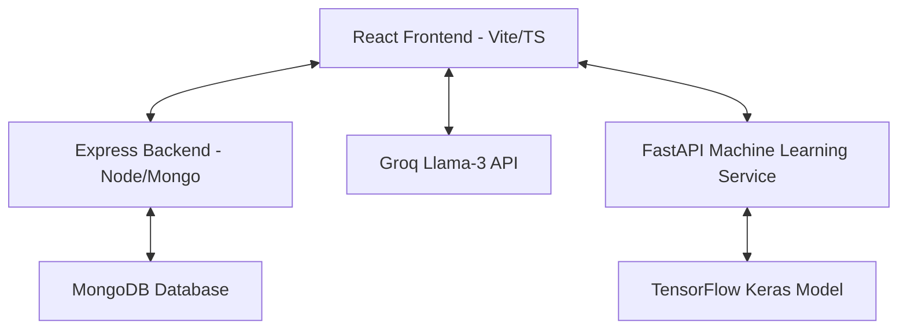

# SmartAgro 🌾

SmartAgro is a state-of-the-art, AI-powered agricultural intelligence and advisory platform. It integrates modern technologies like computer vision, large language models (LLMs), Internet of Things (IoT), and real-time data analysis to help farmers optimize yields, monitor crop health, track weather impacts, and manage farm profitability.

---

## 🏗️ Architecture & Tech Stack



### 1. Frontend (`/frontend`)
* **Framework:** React 18, Vite, TypeScript
* **Styling:** Tailwind CSS (v3), Framer Motion (for smooth glassmorphism animations)
* **Icons & Charts:** Lucide React, Recharts (for weather and statistics visualization)
* **Features:** Auth integration, AI Advisor chat panel, real-time weather analytics, mandi market prices, and Gov Schemes browser.

### 2. Backend Server (`/server`)
* **Runtime:** Node.js (Express)
* **Database:** MongoDB (Mongoose ODM)
* **Authentication:** Cookie-based JWT sessions
* **APIs:** Crop/field profiles, historical chat log caching, and farm statistics.

### 3. Machine Learning Backend (`/backend`)
* **Framework:** Python, FastAPI, Uvicorn
* **Deep Learning:** TensorFlow, Keras (EfficientNetB0)
* **Model:** Plant disease classification model running on image specimens.

---

## 🌟 Core Features

* **🌾 Crop & Fertilizer Prediction:** Input soil NPK values and pH to receive optimized crop suitability suggestions and custom AI-generated fertilizer advice (integrated with Groq API).
* **📸 AI Crop Disease Scanner:** Upload plant leaf images to classify and identify diseases (Late Blight, Yellow Leaf Curl, etc.) instantly with a confidence rating and treatment protocols.
* **⛅ Weather Intelligence:** Hyper-local weather forecasting with direct suggestions on how climate changes impact specific crops (irrigation, disease risks).
* **📈 Mandi Prices:** Live market trends tracking agricultural commodity rates and price fluctuations.
* **🏛️ Government Schemes:** Comprehensive list of active agricultural subsidies and direct links to apply.
* **🤖 Voice Assistant:** Hands-free voice assistant widget supporting voice-guided platform navigation.

---

## 🚀 Quick Start Guide

### Prerequisites
* [Node.js](https://nodejs.org/) (v18+)
* [Python](https://www.python.org/) (v3.9+)
* [MongoDB](https://www.mongodb.com/) (running instance)

---

### Step-by-Step Installation

#### 1. Setup the Server Backend
```bash
cd server
npm install
```
Create a `.env` file in the `server` directory:
```env
PORT=5000
MONGO_URI=mongodb://localhost:27017/smartagro
JWT_SECRET=your_jwt_secret
GROQ_API_KEY=your_groq_api_key
DISEASE_API_URL=http://localhost:5001
NODE_ENV=development
```
Start the backend server:
```bash
npm run dev
```

#### 2. Setup the Machine Learning Backend
```bash
cd backend
python -m venv venv
source venv/bin/activate  # On Windows: venv\Scripts\activate
pip install -r requirements.txt
```
Ensure your disease classification model weights file (`disease_model.h5` or `disease_model.weights.h5`) is placed inside the `model/` folder in the root workspace.

Start the FastAPI ML server:
```bash
python app.py
```

#### 3. Setup the Frontend
```bash
cd frontend
npm install
```
Create a `.env` file in the `frontend` directory:
```env
VITE_API_URL=http://localhost:5000
VITE_DISEASE_API_URL=http://localhost:5001
VITE_GROQ_API_KEY=your_groq_api_key
VITE_WEATHER_API_KEY=your_openweather_api_key
```
Start the frontend development server:
```bash
npm run dev
```
 
## Environment & running notes

To avoid common misconfiguration issues, here are concise runtime details and required environment variables grouped by service.

- **Server (server/)**: defaults and required variables
    - **Required:** `MONGO_URI`, `JWT_SECRET` (strong; >=32 chars recommended), `GROQ_API_KEY`, `DISEASE_API_URL`, `NODE_ENV`.
    - **Optional / defaults:** `PORT` (default `5000`).
    - See validation logic in `server/src/config/validateEnv.js` for exact requirements and a helper to generate a secure JWT secret.

- **Machine Learning backend (backend/)**
    - **Defaults / notes:** the FastAPI app uses `PORT` (default `5001`) when run via `python app.py`.
    - **CORS / FRONTEND_URL:** `FRONTEND_URL` may be used to allow production frontend origins; local dev allows `http://localhost:5173` and `http://localhost:3000`.
    - **Model files:** place your model under the repo `model/` directory. Supported options (in order of preference by the code):
        1. `disease_model.h5` (full Keras model)
        2. TensorFlow SavedModel directory at `model/disease_model`
        3. `disease_model.weights.h5` (weights only — code will rebuild the architecture before loading)

- **Frontend (frontend/)**
    - **Required:** `VITE_API_URL`, `VITE_DISEASE_API_URL`, `VITE_GROQ_API_KEY`, `VITE_WEATHER_API_KEY` (for any weather features used).
    - Start the dev server with `npm run dev` (Vite defaults to port `5173`).

Notes:
- The backend server's default HTTP port is `5000` (see `server/src/server.js`). The ML FastAPI server defaults to `5001` (see `backend/app.py`). Keep these values consistent in `.env` files and `VITE_API_URL` / `VITE_DISEASE_API_URL` to avoid CORS issues.
- If the ML model is not present at startup, the `backend` will warn and return 503 for prediction requests until a model is added.

## Missing files & recommended small additions

- The README references `DEPLOYMENT_SETUP.md` for production deployment instructions, but that file is not present in this repository. Add `DEPLOYMENT_SETUP.md` with your preferred deployment steps (Vercel for frontend, Render/Heroku/Server for backend, MongoDB Atlas connection notes), or remove the reference if not needed.
- The README states the project is licensed under the MIT License, but there is no `LICENSE` file in the repo. Add a `LICENSE` file (MIT) to match the README and consider adding a license badge near the top.

## Troubleshooting tips

- `Model not loaded` / prediction returns 503: ensure one of the supported model files is placed in `model/` and restart the ML server.
- `MongoDB connection failed`: verify `MONGO_URI` and network access to Atlas or your Mongo instance.
- Weak `JWT_SECRET`: use the helper in `server/src/config/validateEnv.js` or generate one with Node: `node -e "console.log(require('crypto').randomBytes(32).toString('hex'))"`.

---

### 🌐 Production Deployment

For production deployment to Vercel + Render + MongoDB Atlas, see `DEPLOYMENT_SETUP.md` in the root directory.

---

## 🔒 License
This project is licensed under the MIT License.
